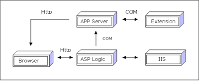



## Tutorial On Application Severs: Develop Killer Web Applications In VB\.\.

### Description

This Tutorial will teach you the Ins and outs of creating custom Application Servers. Get the power to make true killer VB web applications, and give more scalability to your existing applications. 
If you are new to the term <b>'Application Server'</b>, just consider that it is an application that runs between a thin front end (in this case the web browser) and back end servers: After reading this article, you can 
(a) Understand what is an 'Application Server'
(b) Create an Application Server, with a general

handler
(c) Extend the Application Server with additional logic.(In this case, a 'Banner Creator', which can create Banners with respect to user requests, and writes the picture back to them) 
 Also, kindly VOTE for me, if you find it interesting..b'coz I took 6-7 solid hours to write it 
 <b> Your's Anoop M Nedumkunnam </b>
 
### More Info
 

             |
---                |---
**Submitted On**   |2000-10-22 16:34:46
**By**             |[Anoop Madhusudanan](https://github.com/Planet-Source-Code/PSCIndex/blob/master/ByAuthor/anoop-madhusudanan.md)
**Level**          |Intermediate
**User Rating**    |4.7 (302 globes from 64 users)
**Compatibility**  |VB 6\.0, VB Script, ASP \(Active Server Pages\) 
**Category**       |[Complete Applications](https://github.com/Planet-Source-Code/PSCIndex/blob/master/ByCategory/complete-applications__1-27.md)
**World**          |[Visual Basic](https://github.com/Planet-Source-Code/PSCIndex/blob/master/ByWorld/visual-basic.md)
**Archive File**   |[CODE\_UPLOAD1088110222000\.zip](https://github.com/Planet-Source-Code/anoop-madhusudanan-tutorial-on-application-severs-develop-killer-web-applications-in-vb__1-12237/archive/master.zip)

### Source Code

Dear Friends,

Kindly see the attached ZIP for the article and associated projects. Anyway, here is a short introduction. As you know, now a days, the term <b>Application
Server</b> is becoming so hot. An Application Server
is a software that runs on the middle layer. I mean; it runs between a thin front end (in this case the web browser) and
back end servers.

Most Application Servers rely on Internet Servers, to pass
information/data to clients on the web. Application Servers are expected to support COM (Component Object Model) and/or CORBA (Common
Object Request Broker Architecture) frameworks. 
 
In this case, we are creating an Application Server that supports COM interface.
After reading this, you can

<ul>
 <li>Get an idea about Application Servers.</li>
 <li>Create and use your own COM based Application Servers.</li>
 <li>Write directly to RESPONSE object from
 a COM component (Got it? Instead of passing a value back to a variable in ASP to write it to response object, write
 directly to response object from your component)</li>
 <li>See how to integrate additional logic (say your existing
 business COM objects) using our Application Server</li>
</ul>

Also, if you are the CEO of an IT/Web
company, don't forget to read about my ventures in the preface section
:-).  OOPS, forgot to tell all of you one thing; VOTE for me please,
because I took nearly 6-7 hours to write this completely :-) (ofcourse, the brain work is extra.lol.)

Always ur's Anoop, <a href="mailto:anoopj13@yahoo.com">anoopj13@yahoo.com</a>

 

